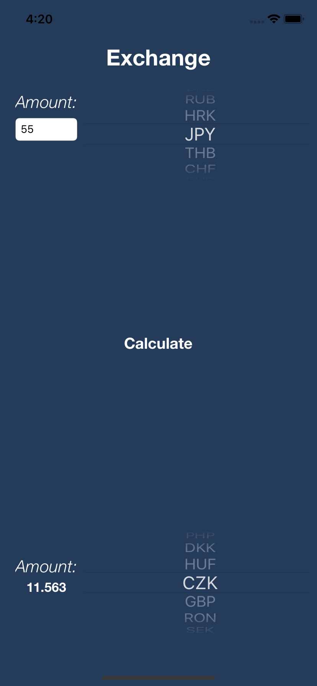
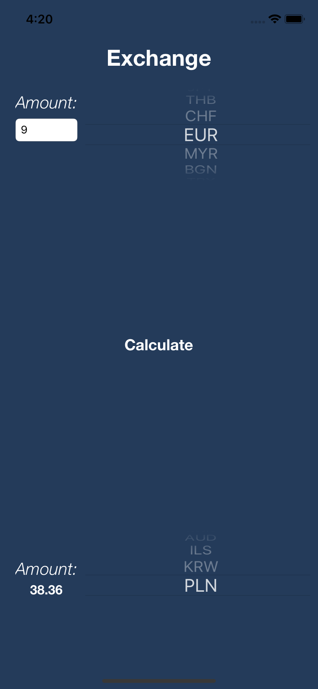

# Exchange
Simple app written in swift that shows current currency exchange rates

## Features
* showing current exchange rates (Using REST API and api.exchangeratesapi.io) 
* user can pick from most of major currencies (for ex. USD, EUR and GBP) 

## Used technologies
* Swift 4 
* AutoLayout (for app layout)
* SwiftyJSON framewrok (for parsing JSON)
* Alamofire framework (for downloading data from website)

##### Project Done: July 2019

